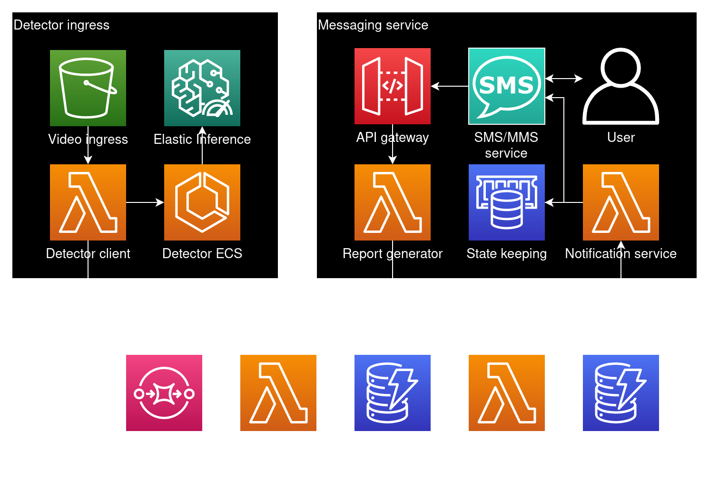

=====================================
Serverless real time video processing
=====================================

Powered by the Cloud, AI, events, and other buzzwords

The Serverless hype
===================

What does serverless mean?
--------------------------

.. figure:: _static/empty_racks.jpg

AWS Compute startup times
-------------------------

.. Speaker note

.. revealjs_fragments::

    * EC2 - minutes
    * Fargate - seconds
    * Lambda - milliseconds (when warm and cozy)
    * https://firecracker-microvm.github.io/

Lambda lifecycle
----------------

.. code-block:: python

    print('initialized')

    def handler(event, context):
        print('executed')

        return {
            'message': 'done'
        }

Edifice Corb
============

.. figure:: _static/corbusier.jpg

* Named after some weird French dude
* Real time person detection
* User interface through SMS

Architecture
------------

