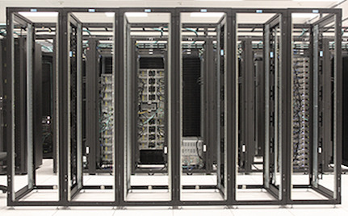
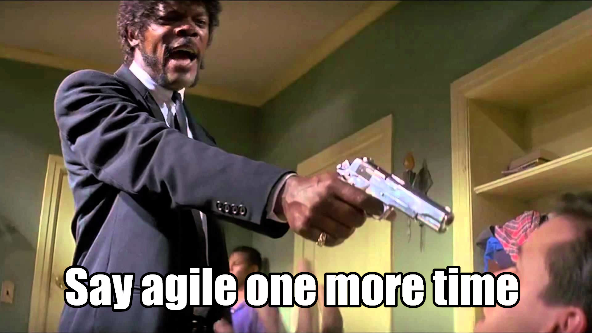
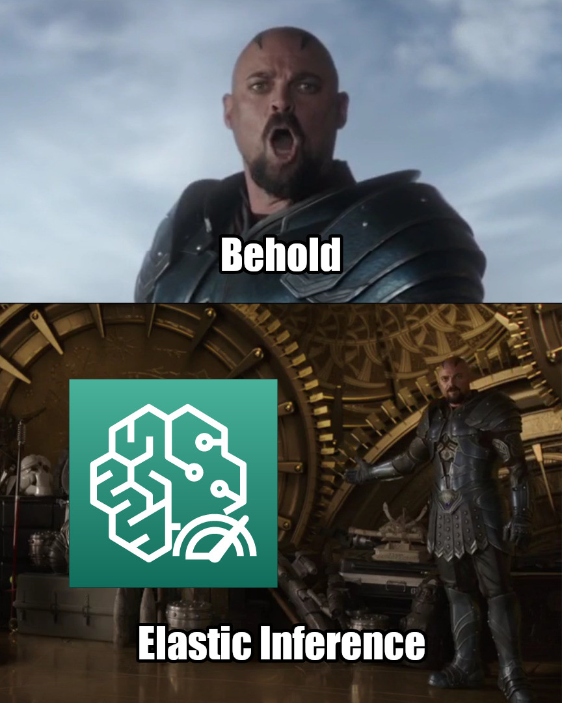
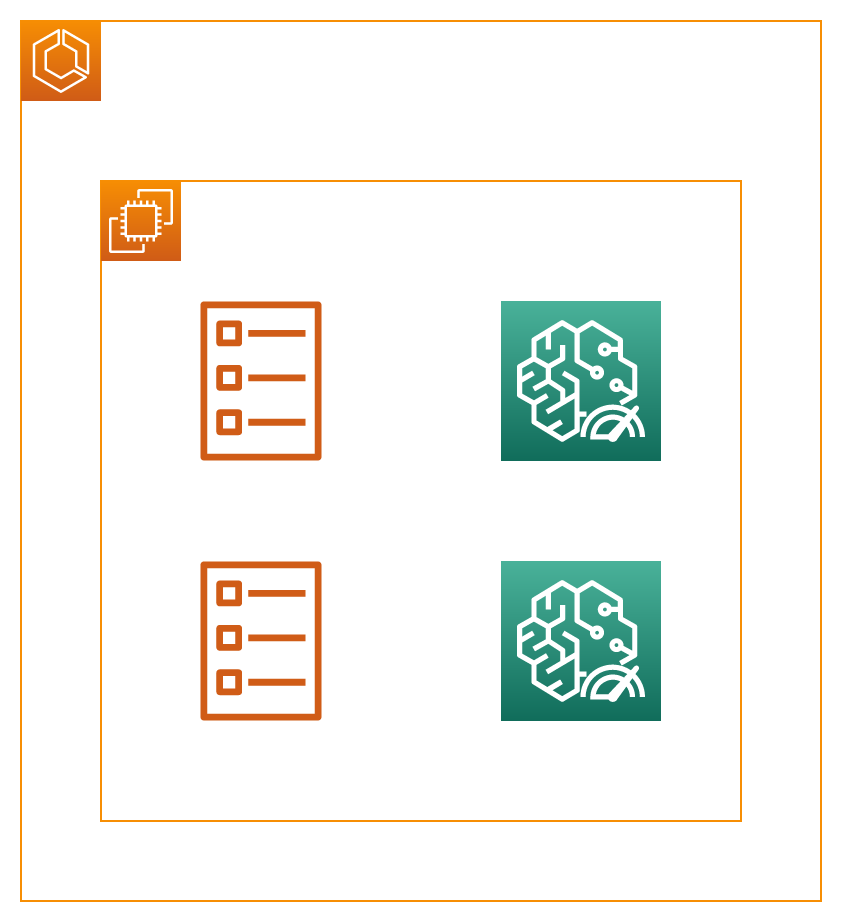
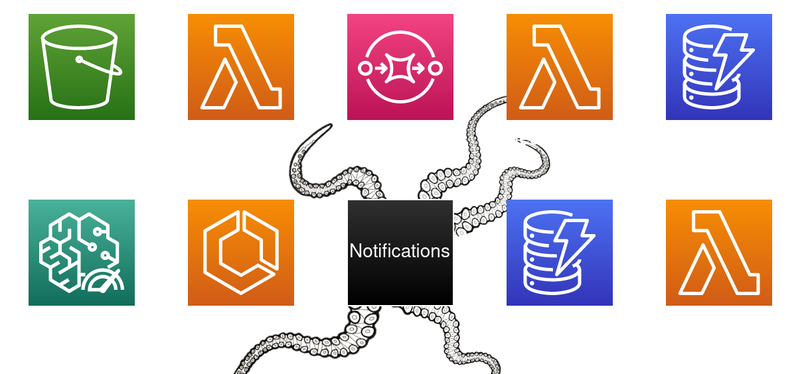
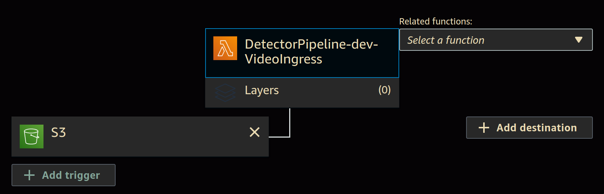
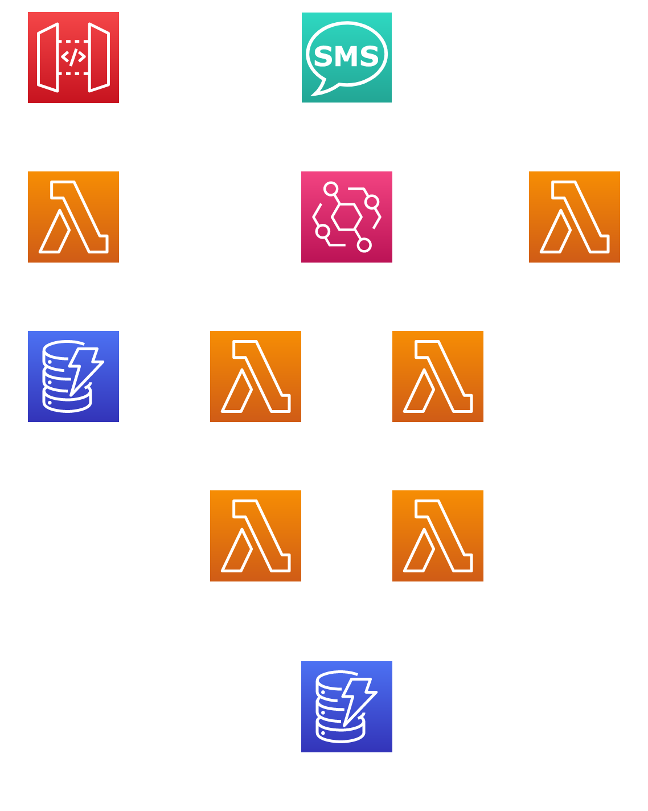
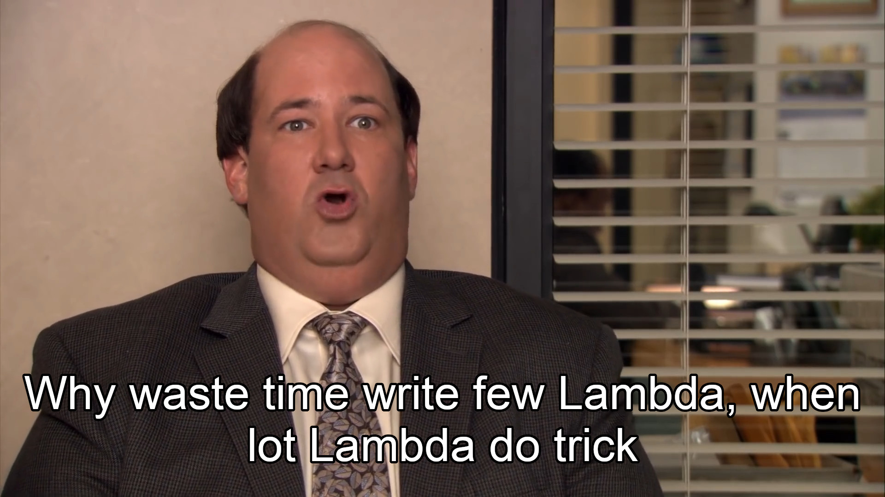

=====================================
Serverless real time video processing
=====================================

Powered by the Cloud, AI, events, and other buzzwords

The Serverless hype
===================

What does serverless mean?
--------------------------

AWS Compute startup times
-------------------------

.. revealjs_fragments::

    * EC2 - minutes
    * Fargate - seconds
    * Lambda - milliseconds (when warm and cozy)
    * https://firecracker-microvm.github.io/

The Lambda lifecycle
--------------------

.. code-block:: python

    print('initialized')

    def handler(event, context):
        print('executed')

        return {
            'message': 'done'
        }

Edifice Corb
============

* Named after some weird French dude
* Real time person detection
* User interface through SMS

Rapid iteration
---------------

Person detection
================

* Tensorflow model
* Inference on video frames is compute intensive
* EC2 GPU instances are neither serverless nor cheap

AWS to the rescue
-----------------

Still not serverless
--------------------

The AWS SageMaker of six paths
------------------------------

* Managed end-to-end ML service
* Model training, deployment, and monitoring
* SageMaker studio, an "IDE for ML"

Processing pipeline
===================

Triggers and destinations
-------------------------

Serverless framework
--------------------

True yaml engineering

Triggering events
-----------------

.. code-block:: yaml

    functions:
      VideoIngress:
        handler: aws_lambda.run_detector.handler
        events:
          - s3:
              bucket: video-bucket
              event: s3:ObjectCreated:*
              rules:
                - suffix: .mkv

Other serverless goodies
------------------------

* Automatic IAM roles
* Easy additional permissions
* Lots of functionality for little code

Other serverless badies
-----------------------

* CloudFormation bad, Terraform good
* Multiple environments are harder to implement
* Hardcoding and code duplication

Messaging pipeline
==================

Y tho?
------

More triggers and destinations
------------------------------

.. code-block:: yaml

  CleaningReportGenerator:
    handler: aws_lambda.request_cleaning.handler
    events:
      - eventBridge:
          pattern:
            detail:
              responsePayload:
                command_type:
                  - request_cleaning
    destinations:
      onSuccess: arn:aws:events:::event-bus/default

EventBridge - Central point of success
--------------------------------------

* Arbitrary event routing and scheduling
* All services produce events
* Cheap af (even free if used correctly)
